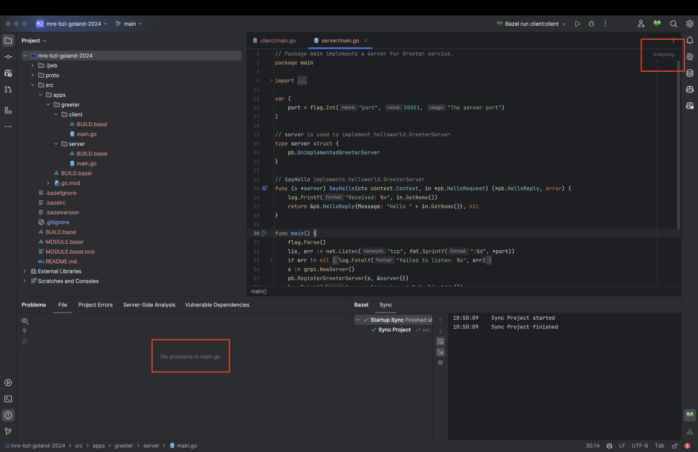
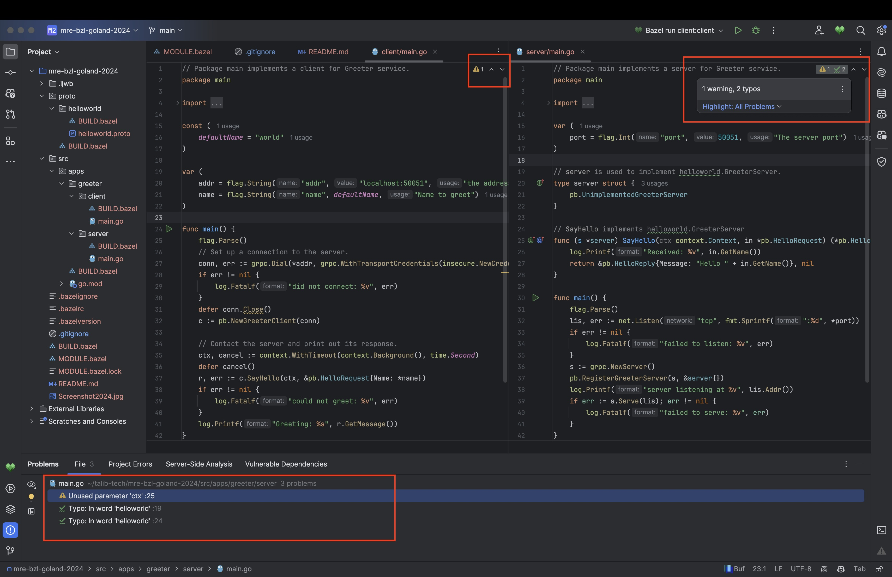

# mre-bzl-goland-2024

This repository is a minimal reproducible example for a bug
in [Bazel for IntelliJ](https://plugins.jetbrains.com/plugin/8609-bazel-for-intellij) when using GoLand 2024.1.
It uses [grpc-go's helloworld example](https://github.com/grpc/grpc-go/tree/master/examples/helloworld) to demonstrate
the issue.

Bazel for IntelliJ Version: `2024.04.09.0.1-api-version-241`

Goland Info:
```
GoLand 2024.1
Build #GO-241.14494.238, built on March 28, 2024
Runtime version: 17.0.10+8-b1207.12 aarch64
VM: OpenJDK 64-Bit Server VM by JetBrains s.r.o.
macOS 14.4.1
GC: G1 Young Generation, G1 Old Generation
Memory: 3072M
Cores: 8
Metal Rendering is ON
Registry:
ide.completion.variant.limit=500
suggest.all.run.configurations.from.context=true
ide.experimental.ui=true
terminal.new.ui=true
Non-Bundled Plugins:
PythonCore (241.14494.240)
mobi.hsz.idea.gitignore (4.5.3)
com.github.copilot (1.5.2.5345)
com.fapiko.jetbrains.plugins.better_direnv (1.2.2)
com.google.idea.bazel.ijwb (2024.04.09.0.1-api-version-241)
```

## Steps to reproduce

1. Clone this repository:

   ```shell
   gh repo clone amjadtalib/mre-bzl-goland-2024
   ```
2. Build the project:

   ```shell
   bazel build //...
   ```
3. Run the server:

   ```shell
   bazel run //src/apps/greeter/server:server
   ```
4. Run the client:

   ```shell
   bazel run //src/apps/greeter/client:client
   ```
5. Import the bazel project in GoLand 2024.1.1 using default project settings.
6. Open either `src/apps/greeter/client/main.go` or `src/apps/greeter/server/main.go`.
7. Notice the editor's problems highlighting is stuck in `Analyzing...`:

   

## Expected behavior
1. Open the repository in GoLand 2023.3.6.
2. Open either `src/apps/greeter/client/main.go` or `src/apps/greeter/server/main.go`.
3. Notice the editor's problems highlighting is working as expected:

   